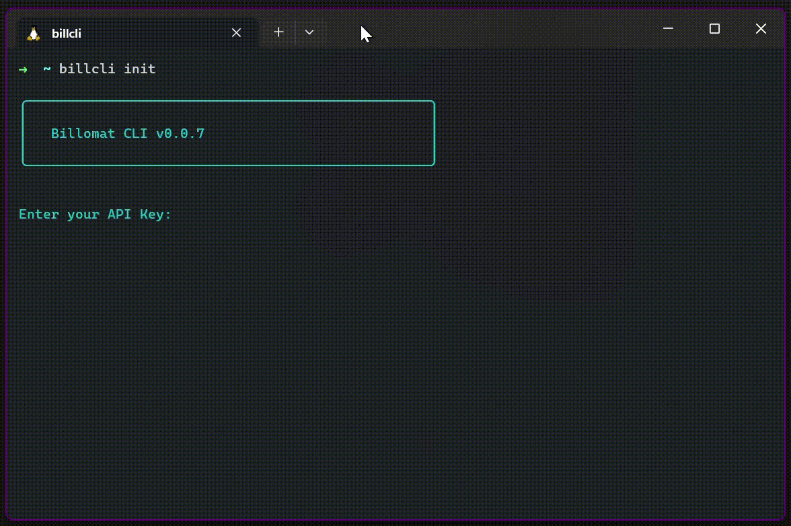

# ( Unofficial ) Billomat CLI 👾🧪 ( Pre-Alpha )

<!-- ## Screenshot -->
<!--  -->

## Install

`$ npm install -g @vlrmprjct/billomat-cli`

### Usage ( Available commands )

| Command      | Description              | Arguments                |
| ------------ | ------------------------ | ------------------------ |
| `init` | Initialize cli |  |
| `activity` | Show activity feed | `--watch` Polls the activity feed, default 15sec `--watch <interval>` Set poll interval in milliseconds |
| `search` | Search across documents | `--term <term*>` Required*, provided search term `--type <type>` Type of document `--size <int>` Amount of listed results |
| `resource` | List documents | `--type <type*>` Required*, type of document resource `--page <int>` page of resultset `--size <int>` Amount of listed results `--sort <string>` column sort (same as API) `--desc` Reverse column order direction   Current available resources: _Articles, Clients, Suppliers_  |
| `version` | show current version | `--check` Check available package version @ npm |
| `help` | This command |  |

### CLI fun part and examples 🦄

`$ clib search --term something --type articles >> export.txt`

`$ clib search --term something >> export-1.txt && clib search --term otherthings >> export-2.txt`

`$ clib resource --type articles`

`$ clib resource --type clients --size 10 --page 2 --sort name`

`$ clib resource --type clients --size 10 --page 2 --sort name && clib resource --type articles --size 10 --page 3`

---

## Requirements

* `node v18.15.0`

* `npm v9.5.0`

---
## Develop

`$ git clone git@github.com:vlrmprjct/billomat.cli.git`

`$ cd billomat.cli`

`$ npm ci`

### API Url

To use the dev-version of the API set the following:

`$ export NODE_ENV=development`

Remove environment variable to use prod-version:

`$ unset NODE_ENV`

### Make Executable

`$ chmod +x cli.js`

### Usage

`$ ./cli.js [command] [--args]`
